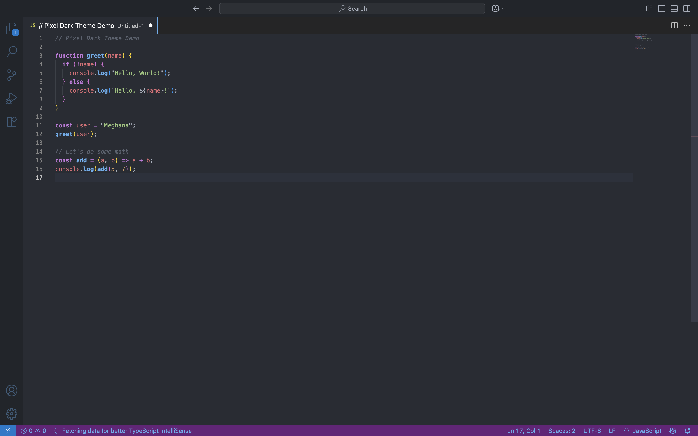

# 🌒 Pixel Dark - VS Code Theme

A warm, pixel-art inspired dark theme for Visual Studio Code — designed with glowing ember syntax, retro dashboard vibes, and soothing tones for long coding sessions.

## 🚀 Features

- Ember-glow syntax highlighting
- Optimized for readability & low-eye strain
- Smooth contrast for strings, functions, variables, and comments

## 📦 Installation

1. Go to the [Visual Studio Marketplace](https://marketplace.visualstudio.com/items?itemName=SithijaMeghana.pixel-dark)
2. Click **Install** or use `ext install SithijaMeghana.pixel-dark` in VS Code

## 💡 Feedback & Contributions

Suggestions? PRs? Issues? All welcome!

---

🖤 Created by [@megatrann](https://github.com/megatrann)
